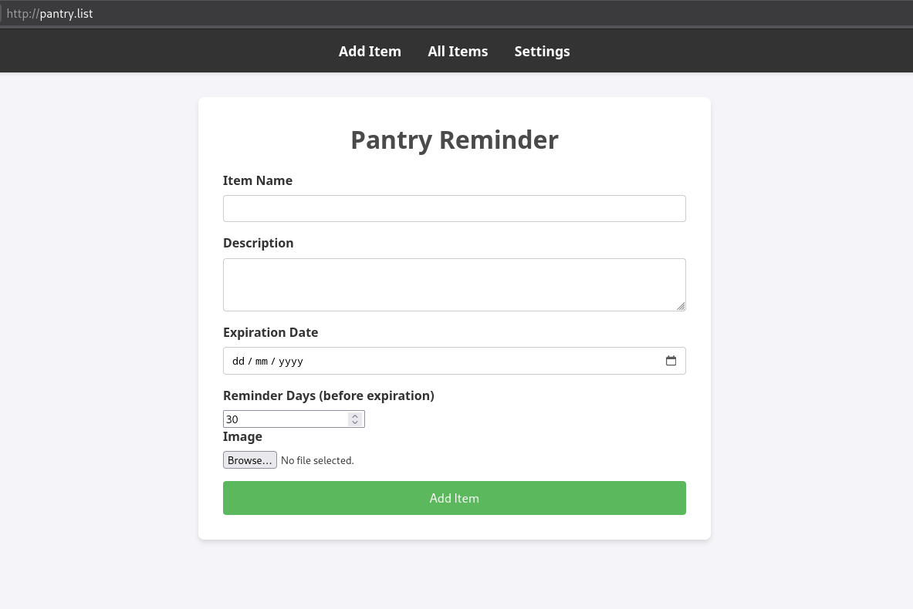
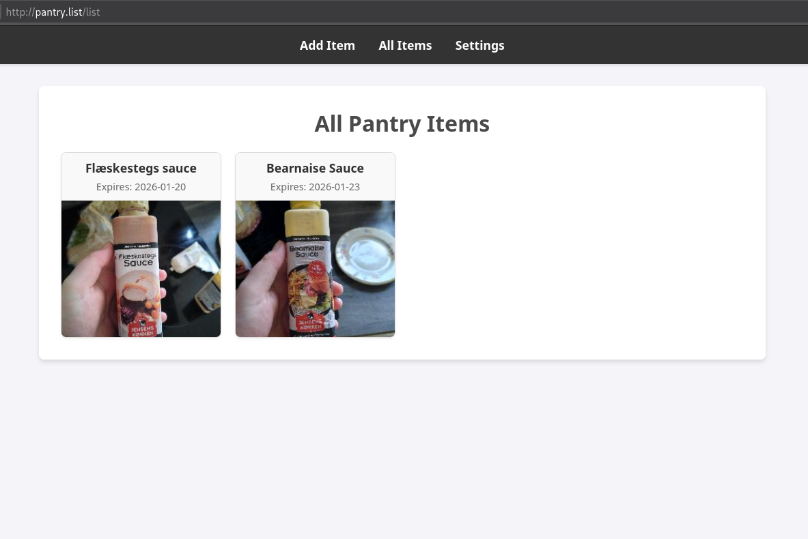
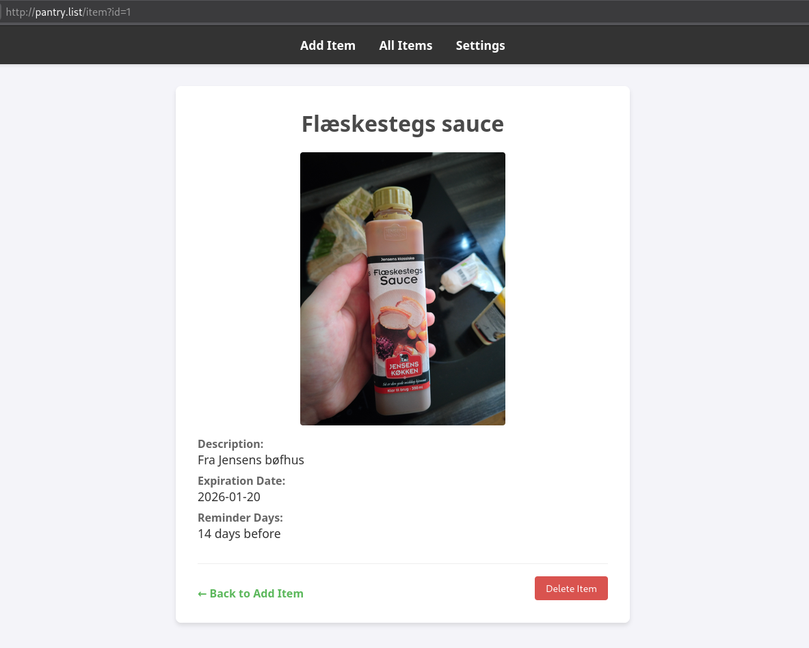
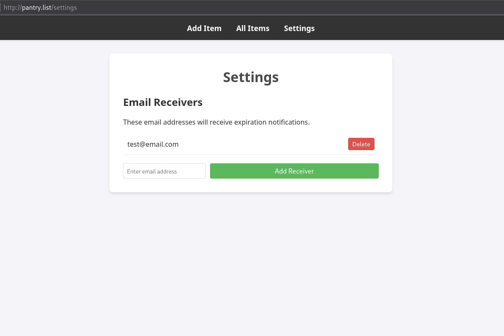

# Pantry Reminder
This is a small project to remind me when my food is going to expire. It is a pure go project with a sqlite database and a simple html interface.

## Features
- Add items to the database
- View all items
- View a single item
- Delete a single item
- Send email notifications when an item is about to expire

# Usage
Run with `go run .` or build with `go build .` and run the generated binary.

Set the environment variables `GMAIL_USER=[your-gmail-email] GMAIL_PASSWORD=[your-gmail-app-password]` to enable email notifications. The password is an app password when using 2FA, which you can generate from your google account.

# Images

    

    

    

    

